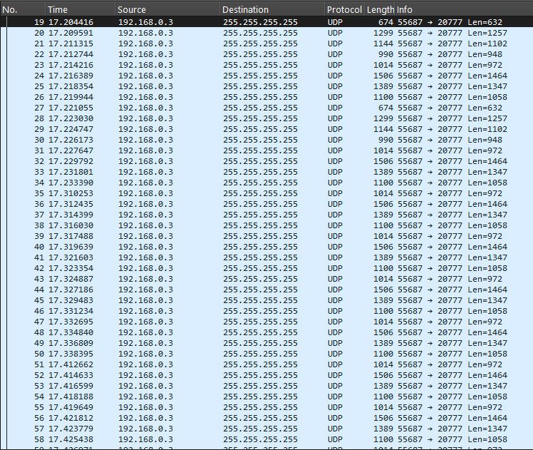

### tcpdump

1. command used to capture network packets
   ```sh
   sudo tcpdump -i wlan0 host 192.168.0.3 and port 20777 and udp -X -w test.pcap
   ```
2. this tool is used to capture and write network packets to a file (in our case UDP telemetry packets from f1)

### tcpreplay

1. command used to replay network packets
   ```sh
   sudo tcpreplay -i wlan0 test.pcap
   ```
2. this tool is used to replay network packets from a file (it has a feature o run them at the original speed)
   NOTE: my linux server stops working as soon as i run this command, so couldn't test it.

### pcap file analyzed by wireshark


### single packet contents in hex format


### SessionPacket bytes manually parsed in this library


### MotionPacket bytes manually parsed in this library
